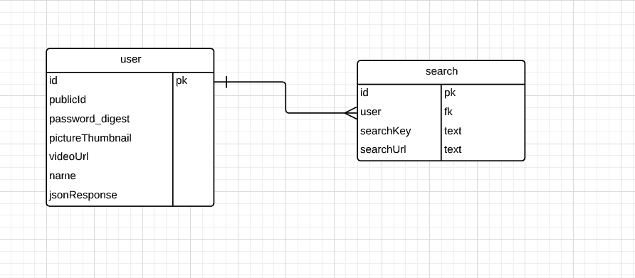

# torrewrap-api | API Documentation

## Project description

This API serves as a backend for the full-stack take-home project, 'torreWrap'. This repository contains the backend portion of the mentioned project. To get access to the frontend portion, please follow [this link](https://github.com/canriquez/torrewrap).

### Full stack application concept

When the user enters the Torre.co username, the app will check the username validity using the torreWrap-API endpoint. The torreWrap-API will hit the Torre.co API to fech the required user information. If this operation fails, then the front end will not progress until a valid user is submitted. After a right user is provided (canriquez), the app will give the form to enter the password. A valid TorreWrap-API password must be provided.

This API, serves as pass through to consume Torre.co endpoints. Also, this API provides a model to store the search-keys for the users while consuming the Torre.co APIs for jobs and persons.

### Live demo @Heroku

[torrewrap-api.herokuapp.com](https://torrewrap-api.herokuapp.com)

### Database Entity Relation Diagram (ERD)



# Authentication and Authorization

## Authentication: Access to resources

Due to time constraints, uses no method for reliably ensuring session persistence. When the user provides the right login credentials, the API will send a JSON object, including the user_id in the database. This user Id, is then stored in the front end's local storage and will be sent back to the API for additional requests to request authentications.

# API Endpoints

|        | Features                                    | Level     | REST | ENDPOINT         |
| ------ | ------------------------------------------- | --------- | ---- | ---------------- |
|        |                                             |           |      |                  |
|        |                                             |           |      |                  |
|        |                                             |           |      |                  |
| Signin | NavMenu                                     | Sign In   | POST | /auth/login      |
|        |                                             |           |      |                  |
|        |                                             |           |      |                  |
| Check  | Validates Torre\.co Public_id existance     | checkup   | GET  | /auth/person/:id |
|        |                                             |           |      |                  |
| Check  | Validates TorreWrap valid user by public_id | checkup   | GET  |                  |
|        |                                             |           |      |                  |
|        |                                             |           |      |                  |
| Signup | NavMenu                                     | Signup    | POST | /signup          |
|        |                                             |           |      |                  |
|        | Parametros                                  | public_id |      |                  |
|        | Parametros                                  | password  |      |                  |

### API endpoint testing

For testing purposes, I recommend you use the application [Postman](https://www.postman.com/), so you can test endpoints and functionalities.

## Test

- This projects uses `RSpec` for testing models and controllers
- The tests set, executes 18 tests that drove the API implementation (TDD).
- To run the test run

```
$ rspec

Finished in 5.23 seconds (files took 2.74 seconds to load)
18 examples, 0 failures
```

## Built With

- Ruby (2.6.5p114)
- Ruby on Rails (6.0.3.3)
- PostgreSQL (12.4)
- RSpec
- Capybara
- FactoryBot
- Shoulda-Matchers

## Authors

👤 Carlos Anriquez

- Github: [@canriquez](https://github.com/canriquez)
- Twitter: [@cranriquez](https://twitter.com/cranriquez)
- Linkedin: [linkedin](https://www.linkedin.com/in/carlosanriquez/)
- Portfolio: [www.carlosanriquez.com](https://www.carlosanriquez.com/)

## 🤝 Contributing

Contributions, issues, and feature requests are welcome!

Feel free to check the [issues page](issues/).

## Acknowledgments
